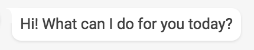
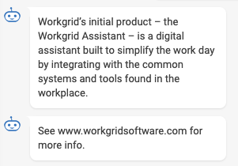
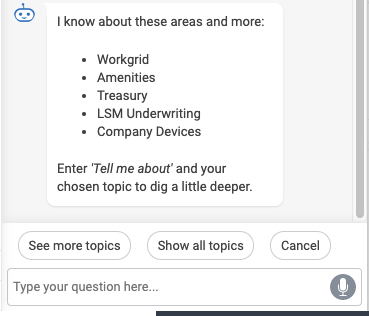
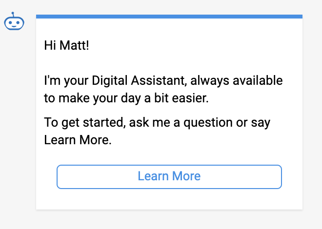

# Conversation Builder


The <b>ConversationBuilder</b> includes helper methods for constructing the response.
A Response may contain multiple elements, and the helper methods aid in generating responses, reducing the need to initialize and set the elements of each response.
ConversationBuilder is available via @workgrid/conversation-builder.

## Installation

```bash
$ npm install @workgrid/conversation-builder
```

## Usage

```js
import ConversationBuilder from '@workgrid/conversation-builder'

const builder = new ConversationBuilder()
builder.withTitle('Exciting Title')
builder.withText('Some response text')
builder.withImage('https://www.messengerpeople.com/wp-content/uploads/2018/08/knowhow-chatbots2-5bots.png')
builder.withUrl('https://www.workgrid.com/')
builder.withDetail('Additional detail for your answer')
builder.withOptions(['Option Button 1', 'Option Button 2', 'Option Button 3'])
builder.withSuggestions(['Suggestion 1', 'Suggestion 2', 'Suggestion 3'])
builder.withCard(true)
builder.build()
```

## How It Works

At a minimum, the `.withText` method must be used to supply some text for a response.

- `.withText` - will render standard text.
  - N.B. The text specified may be split across a **maximum of 2 speech bubbles** by using the '(newbubble)' delimiter
    between the text for each bubble, for example 'withText('Text for 1st speech bubble.(newbubble)Text for 2nd bubble')
- `.withCard(true)` - will wrap the response in a card format.
- `.withOptions` will add option buttons for the user to choose from in the response.
- `.withSuggestions` - will render suggestion chips which will appear above the chatbot textbox to guide the user
- `.withImage` - will render an image if an image url is specified.
- `.withOptions` - will render buttons with the labels supplied
- `.withUrl` - will add a url (below the main text) N.B. the response text itself can also contain hyperlinks

#### Elements which are only applicable to "Card" format responses

- `.withCard` - will wrap the response elements in a card format (styled div).
  - This would typically be used for static answers to questions like "What is Workgrid?"
- `.withTitle` - will render a Title if "card" format has been selected
- `.withDetail` - will add more detailed text (below the main text) if "card" format has been selected.
  - The detailed text may be split across a **maximum of 2 paragraphs** using the '\n\n' delimiter between the paragraphs,
    e.g. `withDetail("Contents of 1st paragraph.\n\n Contents of 2nd paragraph.")`

## Example responses

#### Simple Text only Response

```js
const builder = new ConversationBuilder()
builder
.withText('Hi! What can I do for you today?')
.build()
```



#### Double Bubble Response

```js
const builder = new ConversationBuilder()
builder
.withText(
  'Workgrid’s initial product – the Workgrid Assistant – is a digital assistant built to simplify the work day by integrating with the common systems and tools found in the workplace. **(newbubble)** See www.workgridsoftware.com for more info.'
)
.build()
```



#### Suggestions Response

```js
const builder = new ConversationBuilder()
builder
  .withText(
    "I know about these areas and more: \n\n - Workgrid \n- Amenities \n- Treasury \n- LSM Underwriting \n- Company Devices \n\nEnter _'Tell me about'_ and your chosen topic to dig a little deeper."
  )
  .withSuggestions('See more topics', 'show all topics', 'Cancel')
  .build()
```



#### Card Response

```js
const builder = new ConversationBuilder()
builder
  .withText(
    "Hi Matt !\n\nI'm your Digital Assistant, always available to make your day a bit easier.\n\n To get started, ask me a question or say Learn More.`"
  )
  .withOptions(['Learn More'])
  .withCard(true)
```


